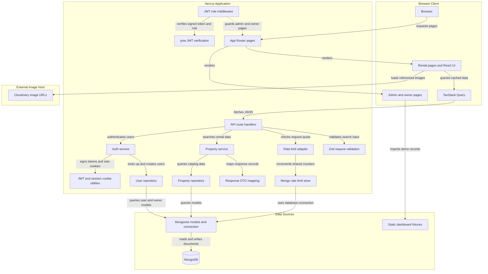
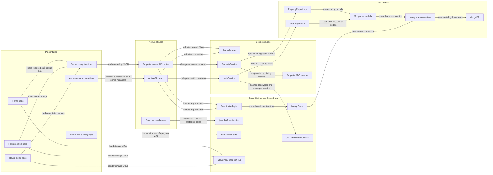

# Architecture Diagram

This is the architecture currently wired in the repository, not a target design. The primary rental-data path is Browser UI -> React Query -> Next.js API route -> service -> repository -> Mongoose -> MongoDB; login and registration use a separate auth service and the same database connection.

## Application Architecture

<!-- mermaid-checked: no \n, no em-dash/en-dash, no {} in labels, subgraphs are id["label"], arrows are -->|"label"|, all subgraphs closed by end, ids unique -->

### Technology Stack Summary

| Layer | Technology | Version | Purpose |
|---|---|---|---|
| Web application | Next.js App Router | `^15.1.6` declared | Page rendering, API route handlers, middleware |
| UI | React | `^19.2.0` declared | Browser interface and interactive pages |
| Client data | TanStack React Query | `^5.101.1` declared | Fetch and cache rental and auth API results |
| Language | TypeScript | `^5.8.3` declared | Application types and source |
| Styling and components | Tailwind CSS, Radix UI | Tailwind `^4.2.1` declared | Styling and accessible UI primitives |
| Request validation | Zod | `^3.25.76` declared | Validates auth and property-search request payloads |
| Persistence | Mongoose and MongoDB | Mongoose `^9.10.3` declared | Models, repository queries, and shared rate-limit records |
| Authentication | jose and bcryptjs | jose `^6.2.12`, bcryptjs `^3.0.3` declared | HS256 JWT sessions and password hashing |
| Image delivery | Cloudinary-hosted image URLs | Not versioned in app | Browser loads image URLs referenced by app data |

Versions above are package-manifest ranges, not a report of resolved runtime versions. The repository does not declare a Node.js version.

### Data Storage & External Services

MongoDB is the persistent store configured through `MONGODB_URI`. The public rental API reads Houses, Categories, and Destinations through `PropertyService` and `PropertyRepository`; auth reads and creates Users through `UserRepository`. MongoDB also stores rate-limit counters through `MongoStore` and a TTL index. The UI references Cloudinary-hosted image URLs directly; no image-upload path is wired in the inspected code. Admin and owner dashboard pages currently import static records from `src/lib/mock-data.ts` instead of reading the Mongo-backed Property and Owner models. Supabase variables are documented as unused demo configuration.

### Key Architectural Decisions

- Rental API routes delegate business work to services, which use repositories and map rental records to API response DTOs.
- Auth uses bcrypt password hashes and signed JWTs in an HTTP-only session cookie; middleware applies role checks to admin and owner page paths.
- Rate limiting uses MongoDB in non-test environments and an in-memory store in tests; the dashboard demo dataset is separate from the live rental catalog.

## Component Relationships

<!-- mermaid-checked: no \n, no em-dash/en-dash, no {} in labels, subgraphs are id["label"], arrows are -->|"label"|, all subgraphs closed by end, ids unique -->

### Component Inventory

| Component | Layer | Type | Responsibility |
|---|---|---|---|
| `app/page.tsx` | Presentation | Client page | Home screen; requests featured houses, categories, and destinations |
| `app/houses/page.tsx` | Presentation | Client page | Reads URL filters and requests rental listings |
| `app/houses/[slug]/page.tsx` | Presentation | Client page | Loads a house by slug and renders its details |
| `src/lib/rentals/api.ts` | Presentation | Query functions | Builds React Query options and calls `/api/properties`, `/api/categories`, and `/api/destinations` |
| `src/lib/auth/api.ts` | Presentation | Query and mutation functions | Calls login, registration, logout, and current-user endpoints |
| `app/admin/**`, `app/owner/**` | Presentation | App Router pages | Dashboard views; inspected admin property page reads local mock data |
| `app/api/properties/**`, `app/api/categories/route.ts`, `app/api/destinations/route.ts` | Routes | Route handlers | Rate-limits public requests and delegates rental reads |
| `app/api/auth/**` | Routes | Route handlers | Validates auth requests, applies rate limits, and calls auth service |
| `middleware.ts` | Routes | Next.js middleware | Checks the session JWT and role for `/admin` and `/owner` page paths |
| `src/server/validations/**` | Business Logic | Zod schemas | Defines auth and property-search input validation |
| `src/server/services/PropertyService.ts` | Business Logic | Service | Searches listings and catalog lookups; maps results for API responses |
| `src/server/services/AuthService.ts` | Business Logic | Service | Registers, logs in, logs out, and resolves the current user |
| `src/server/dtos/property.ts` | Business Logic | DTO mapper | Projects Mongoose listing records into API response fields |
| `src/server/repositories/PropertyRepository.ts` | Data Access | Repository | Queries House, Category, and Destination models |
| `src/server/repositories/UserRepository.ts` | Data Access | Repository | Queries User records and can link an Owner profile |
| `src/lib/models.ts` | Data Access | Mongoose models | Declares User, House, Category, Destination, Property, Owner, HousingRequest, and Deal schemas |
| `src/lib/mongoose.ts` | Data Access | Connection helper | Reuses the MongoDB connection configured by `MONGODB_URI` |
| `src/server/rate-limit/**` | Infrastructure | Rate-limit adapter and store | Uses MongoDB outside tests and memory storage in tests |
| `src/server/utils/auth.ts`, `session-cookie.ts` | Infrastructure | JWT and cookie helpers | Signs/verifies application sessions and reads/writes the HTTP-only cookie |
| `src/lib/mock-data.ts` | Demo data | Static fixture module | Supplies local dashboard properties and owners, separate from the live rental API |
| Cloudinary image URLs in UI and fixtures | External | Image host | Serves referenced property imagery; upload integration was not found |
