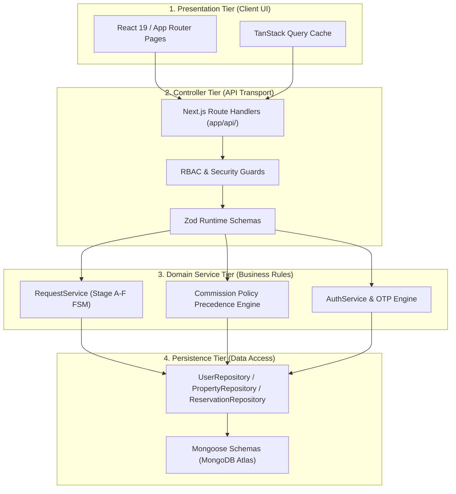
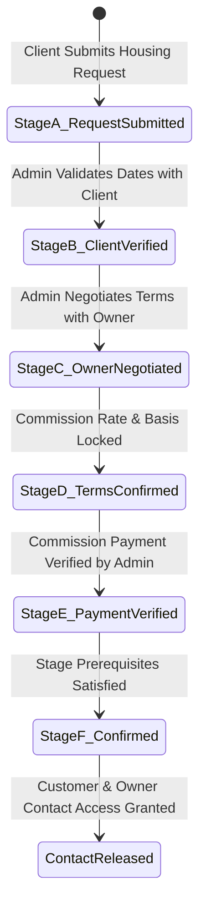

# 🏛️ LOC MAISON — System Architecture & State Machine Blueprint

> 📌 **DOCUMENT PROPERTIES**
> - **Category**: Enterprise Architecture & State Machine Design
> - **Stack**: Next.js 15, Clean Architecture, Finite State Machines (FSM), Immutable Accounting
> - **Authoritative Literature References**:
>   - 📚 *Clean Architecture: A Craftsman's Guide to Software Structure and Design* by Robert C. Martin ("Uncle Bob")
>   - 📚 *Enterprise Integration Patterns* by Gregor Hohpe & Bobby Woolf
>   - 📚 *Building Microservices* by Sam Newman

---

## 📌 Executive Summary

This document specifies the system architecture and state machine lifecycles of LOC MAISON. The application adopts **Clean 4-Tier Architecture** combined with **Guarded Finite State Machines** for multi-stage rental negotiation workflows.

---

## 🏗️ 1. Clean 4-Tier System Layering

---

## 🔄 2. Finite State Machine (Stage A → Stage F Lifecycle)

To prevent race conditions, domain state transitions are strictly guarded by prerequisite validation:

---

## 📚 3. Engineering Literature References

- 📘 **Martin, R. C. (2017).** *Clean Architecture*. Boundaries, dependency inversion rule, and domain model protection.
- 📙 **Hohpe, G., & Woolf, B. (2003).** *Enterprise Integration Patterns*. Message routing, state management, and enterprise integration topologies.
