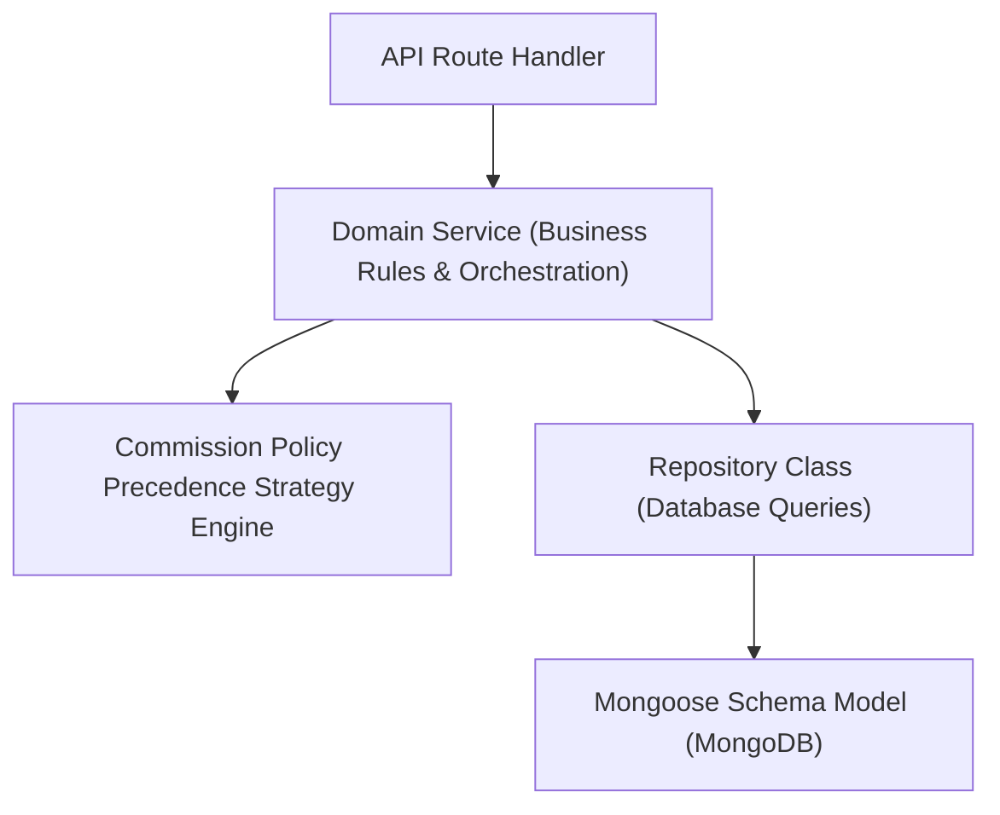

# ⚙️ LOC MAISON — Domain Services & Repository Architecture

> 📌 **DOCUMENT PROPERTIES**
> - **Category**: Backend Services, Data Access Layer, & Business Logic
> - **Stack**: Mongoose, MongoDB Atlas, TypeScript Services & Repositories
> - **Authoritative Literature References**:
>   - 📚 *Patterns of Enterprise Application Architecture* (PoEAA) by Martin Fowler
>   - 📚 *Domain-Driven Design: Tackling Complexity in the Heart of Software* by Eric Evans
>   - 📚 *Clean Architecture: A Craftsman's Guide to Software Structure and Design* by Robert C. Martin

---

## 📌 Executive Summary

This document specifies the server-side business logic tier (`src/server/services/`) and data access tier (`src/server/repositories/`). It explains how domain business rules, precedence engines, and data persistence models are cleanly separated.

---

## 🏗️ 1. Domain Service & Repository Layering



---

## ⚙️ 2. Strategy Pattern Engine (`CommissionPolicyService.ts`)

Performs dynamic commission calculations by resolving rules in strict precedence:

```typescript
export class CommissionPolicyService {
  async calculateCommission(params: {
    propertyId?: string;
    ownerId?: string;
    rentalAmount: number;
    pricePeriod?: "night" | "day" | "month" | "year";
    rateOverride?: number;
  }) {
    // Determine basis: Monthly rentals default to FIRST_MONTH_RENT
    const basis = params.pricePeriod === "month" ? "FIRST_MONTH_RENT" : "TOTAL_RENTAL_VALUE";
    const baseAmount = params.rentalAmount;

    // 1. Check Reservation Level Override
    if (params.rateOverride !== undefined) {
      return this.formatResult(params.rateOverride, basis, baseAmount, "RESERVATION_OVERRIDE");
    }

    // 2. Check Property Level Override
    if (params.propertyId) {
      const propPolicy = await propertyRepository.findPolicy(params.propertyId);
      if (propPolicy) return this.formatResult(propPolicy.rate, basis, baseAmount, "PROPERTY_OVERRIDE");
    }

    // 3. Check Owner Level Override
    if (params.ownerId) {
      const ownerPolicy = await ownerRepository.findPolicy(params.ownerId);
      if (ownerPolicy) return this.formatResult(ownerPolicy.rate, basis, baseAmount, "OWNER_OVERRIDE");
    }

    // 4. Fallback to Platform Default (10%)
    return this.formatResult(10, basis, baseAmount, "PLATFORM");
  }

  private formatResult(rate: number, basis: string, baseAmount: number, source: string) {
    const commissionAmount = Math.round((baseAmount * (rate / 100)) * 1000) / 1000;
    return { rate, basis, baseAmount, commissionAmount, source };
  }
}
```

---

## 📦 3. Repository Abstraction (`UserRepository.ts`)

Encapsulates Mongoose models to allow pure unit testing and single responsibility:

```typescript
export class UserRepository {
  async findByResetToken(token: string) {
    await connectToDatabase();
    if (!token) return null;
    // Pure, idempotent findOne query (never mutates token on read!)
    return UserModel.findOne({
      resetPasswordToken: token,
      resetPasswordExpires: { $gt: new Date() },
    }).exec();
  }

  async updatePassword(userId: string, passwordHash: string) {
    await connectToDatabase();
    return UserModel.findOneAndUpdate(
      { $or: [{ id: userId }, { _id: userId }] },
      { $set: { passwordHash }, $unset: { resetPasswordToken: 1, resetPasswordExpires: 1 } },
      { returnDocument: "after" }
    ).exec();
  }
}
```

---

## 📚 4. Engineering Literature References

- 📘 **Fowler, M. (2002).** *Patterns of Enterprise Application Architecture*. Repository pattern, Data Mapper, and Domain Model implementation.
- 📙 **Evans, E. (2003).** *Domain-Driven Design*. Aggregates, domain services, value objects, and domain invariants.
