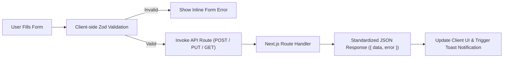

# 🔗 LOC MAISON — Frontend API Integration & Form Validation Guide

> 📌 **DOCUMENT PROPERTIES**
> - **Category**: Frontend API Integration & Form Handling
> - **Stack**: Zod Validation, React Hook Form, Next.js Fetch API, TypeScript DTOs
> - **Authoritative Literature References**:
>   - 📚 *Effective TypeScript: 62 Specific Ways to Improve Your TypeScript* by Dan Vanderkam
>   - 📚 *Full-Stack React, TypeScript, and Node* by David Choi

---

## 📌 Executive Summary

This guide outlines how the LOC MAISON client applications communicate with server API endpoints, validate input forms on the client before transmission, and handle typed API responses.

---

## 🔗 1. Client-to-Server Communication Pipeline



---

## 📝 2. Zod Form Schema Validation

Runtime validation occurs before payload transmission to minimize invalid network roundtrips.

```typescript
import { z } from "zod";

// Phone validation standard for Tunisia (+216)
export const TunisianPhoneSchema = z
  .string()
  .transform((val) => val.replace(/\s+/g, ""))
  .refine((val) => /^(?:\+216|00216)?[2459]\d{7}$/.test(val), {
    message: "Numéro de téléphone tunisien invalide (ex: +216 98 123 456).",
  });

// Negotiation payload schema
export const RecordPaymentSchema = z.object({
  paymentMethod: z.enum(["CASH_IN_HAND", "BANK_TRANSFER", "D17", "FLOUCI", "WAFA_CASH"]),
  amount: z.number().positive("Le montant doit être supérieur à zero."),
  reference: z.string().optional(),
});
```

---

## 🛠️ 3. Unified Error Handling & HTTP Status Interpretation

Client-side API handlers normalize server HTTP errors using typed status handler patterns:

```typescript
export async function apiRequest<T>(url: string, options?: RequestInit): Promise<T> {
  const res = await fetch(url, {
    headers: { "Content-Type": "application/json" },
    ...options,
  });

  const body = await res.json();

  if (!res.ok) {
    if (res.status === 401) {
      // Redirect unauthenticated user to login
      window.location.href = "/login";
      throw new Error(body.error || "Session expirée. Veuillez vous reconnecter.");
    }
    if (res.status === 403) {
      throw new Error("Accès refusé. Droits insuffisants.");
    }
    throw new Error(body.error || "Une erreur est survenue.");
  }

  return body as T;
}
```

---

## 📚 4. Engineering Literature References

- 📘 **Vanderkam, D.** (2019). *Effective TypeScript*. Type narrowing, runtime validation, and API DTO contract sharing.
- 📙 **Choi, D.** (2020). *Full-Stack React, TypeScript, and Node*. Building end-to-end type-safe web applications.
