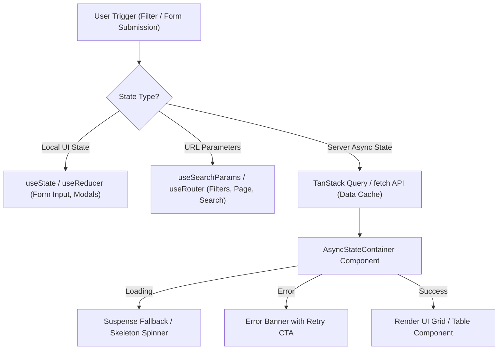

# 🔄 LOC MAISON — Frontend UI Flows & Client State Architecture

> 📌 **DOCUMENT PROPERTIES**
> - **Category**: Frontend Client Architecture & State Management
> - **Stack**: React 19, Next.js App Router, TanStack Query (React Query), React Suspense
> - **Authoritative Literature References**:
>   - 📚 *Learning React: Modern Patterns for Developing React Apps* by Alex Banks & Eve Porcello
>   - 📚 *React Key Concepts* by Maximilian Schwarzmüller
>   - 📚 *Taming the State in React* by Robin Wieruch

---

## 📌 Executive Summary

This document specifies the client-side state flow architecture for LOC MAISON. It covers how client components manage local React state, server state synchronization via TanStack Query, dynamic URL query parameters, and React 19 `<Suspense>` boundaries.

---

## 🔄 1. State Management Architecture



---

## ⚡ 2. Next.js 15 Client Prerendering & React 19 Suspense

In Next.js App Router, pages using `useSearchParams()` require streaming hydration protection to prevent build-time static bailout.

### Code Implementation (`app/admin/properties/page.tsx`)

```tsx
"use client";

// 1. Module-level dynamic export forces runtime server rendering
export const dynamic = "force-dynamic";

import { Suspense, useState, useEffect } from "react";
import { useSearchParams } from "next/navigation";
import { AdminShell } from "@/components/admin/AdminShell";
import { Loader2 } from "lucide-react";

function AdminPropertiesContent() {
  const searchParams = useSearchParams();
  const initialSearch = searchParams.get("search") || "";
  const [properties, setProperties] = useState([]);
  // ... state and data fetching
  return <div>{/* Render table / cards */}</div>;
}

export default function AdminPropertiesPage() {
  return (
    <Suspense
      fallback={
        <AdminShell title="Biens" subtitle="Chargement des logements...">
          <div className="flex h-64 items-center justify-center">
            <Loader2 className="h-6 w-6 animate-spin text-primary" />
          </div>
        </AdminShell>
      }
    >
      <AdminPropertiesContent />
    </Suspense>
  );
}
```

---

## 🛠️ 3. Client Data Fetching Pattern (`AsyncStateContainer`)

To prevent duplicate boilerplate across admin and owner portals, async data fetching uses a unified state container component:

```tsx
export function AsyncStateContainer<T>({
  loading,
  error,
  data,
  onRetry,
  children,
}: {
  loading: boolean;
  error: string | null;
  data: T | null;
  onRetry?: () => void;
  children: (data: T) => React.ReactNode;
}) {
  if (loading) {
    return (
      <div className="flex h-48 items-center justify-center">
        <Loader2 className="h-6 w-6 animate-spin text-primary" />
      </div>
    );
  }

  if (error) {
    return (
      <div className="rounded-xl border border-rose-200 bg-rose-50 p-6 text-center text-rose-700">
        <p className="font-medium">{error}</p>
        {onRetry && (
          <button onClick={onRetry} className="mt-3 text-sm font-semibold underline">
            Réessayer
          </button>
        )}
      </div>
    );
  }

  if (!data) return null;

  return <>{children(data)}</>;
}
```

---

## 📚 4. Engineering Literature References

- 📘 **Banks, A., & Porcello, E.** (2020). *Learning React*. React hooks, asynchronous state flows, and component lifecycle management.
- 📙 **Schwarzmüller, M.** (2022). *React Key Concepts*. Rendering lifecycles, suspense boundaries, and client state isolation.
