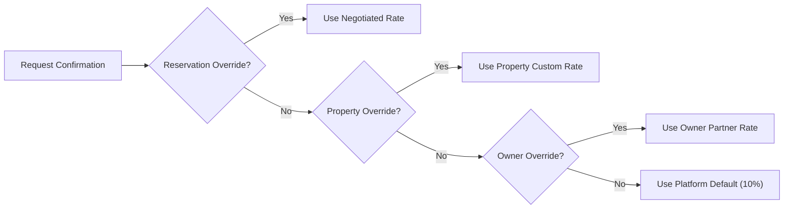

# 🎓 LOC MAISON — Senior MERN Stack Engineering & Interview Masterclass

> 📌 **DOCUMENT PROPERTIES**
> - **Category**: Senior MERN Engineering & Job Interview Masterclass
> - **Stack**: Next.js 15, React 19, Node.js, MongoDB / Mongoose, TypeScript, Tailwind CSS
> - **Authoritative Literature References**:
>   - 📚 *Design Patterns: Elements of Reusable Object-Oriented Software* (GoF) by Erich Gamma et al.
>   - 📚 *Clean Code: A Handbook of Agile Software Craftsmanship* by Robert C. Martin
>   - 📚 *Effective TypeScript* by Dan Vanderkam
>   - 📚 *Node.js Design Patterns* by Mario Casciaro & Luciano Mammino

---

## 📌 Executive Summary

This masterclass turns real production code from **LOC MAISON** into interview-ready design patterns, audited production bug case studies, technical challenges, and senior engineering interview scripts.

---

## 🏛️ 1. Architectural Design Patterns (Interview Cheat Sheet)

<details>
<summary><b>1️⃣ Pattern: Repository Pattern (Persistence Abstraction)</b></summary>

<br/>

> 📌 **Formal Pattern Name**: *Repository Design Pattern* (GoF / Fowler PoEAA)
> - **Where Used**: `src/server/repositories/UserRepository.ts`, `PropertyRepository.ts`, `ReservationRepository.ts`
> - **Why We Use It**: Decouples business logic (`Service` layer) from data persistence (`Mongoose / MongoDB`). If you migrate from MongoDB to PostgreSQL, only repository files change; zero business logic or API routes are touched.

### 💻 Code Implementation (`src/server/repositories/UserRepository.ts`)

```typescript
import connectToDatabase from "@/lib/mongoose";
import { UserModel, IUser } from "@/lib/models";

export class UserRepository {
  async findById(id: string): Promise<IUser | null> {
    await connectToDatabase();
    if (!id) return null;
    return UserModel.findOne({ $or: [{ id }, { _id: id }] }).exec();
  }

  async setResetToken(userId: string, token: string, expires: Date): Promise<IUser | null> {
    await connectToDatabase();
    return UserModel.findOneAndUpdate(
      { $or: [{ id: userId }, { _id: userId }] },
      { $set: { resetPasswordToken: token, resetPasswordExpires: expires } },
      { returnDocument: "after" }
    ).exec();
  }
}

export const userRepository = new UserRepository();
```

> 🎯 **How to Answer in an Interview**:
> *"I implement the Repository Pattern to decouple Mongoose queries from domain business logic. This satisfies the Single Responsibility Principle (SRP), enables pure unit testing without a live MongoDB connection, and prevents query leakage into API route handlers."*

</details>

---

<details>
<summary><b>2️⃣ Pattern: Strategy / Policy Cascade Pattern (Dynamic Pricing)</b></summary>

<br/>

> 📌 **Formal Pattern Name**: *Strategy Pattern / Precedence Policy Chain* (GoF)
> - **Where Used**: `src/server/services/CommissionPolicyService.ts`
> - **Why We Use It**: Calculates platform fees dynamically based on specific conditions without messy nested `if/else` statements.



### 💻 Code Implementation (`src/server/services/CommissionPolicyService.ts`)

```typescript
export class CommissionPolicyService {
  async calculateCommission(params: {
    propertyId?: string;
    ownerId?: string;
    rentalAmount: number;
    pricePeriod?: "night" | "day" | "month" | "year";
    rateOverride?: number;
  }) {
    const basis = params.pricePeriod === "month" ? "FIRST_MONTH_RENT" : "TOTAL_RENTAL_VALUE";
    const baseAmount = params.rentalAmount;

    // 1. Explicit Reservation Override
    if (params.rateOverride !== undefined) {
      return this.buildResult(params.rateOverride, basis, baseAmount, "RESERVATION_OVERRIDE");
    }

    // 2. Property Specific Override
    if (params.propertyId) {
      const propPolicy = await this.getPropertyPolicy(params.propertyId);
      if (propPolicy) return this.buildResult(propPolicy.rate, basis, baseAmount, "PROPERTY_OVERRIDE");
    }

    // 3. Owner Partner Override
    if (params.ownerId) {
      const ownerPolicy = await this.getOwnerPolicy(params.ownerId);
      if (ownerPolicy) return this.buildResult(ownerPolicy.rate, basis, baseAmount, "OWNER_OVERRIDE");
    }

    // 4. Global Platform Fallback (10%)
    const defaultRate = await this.getPlatformDefaultRate();
    return this.buildResult(defaultRate, basis, baseAmount, "PLATFORM");
  }
}
```

> 🎯 **How to Answer in an Interview**:
> *"I use the Strategy Pattern to encapsulate financial calculation algorithms. The precedence cascade allows business admins to set custom deals at the reservation, property, or owner level while maintaining a guaranteed global default margin."*

</details>

---

<details>
<summary><b>3️⃣ Pattern: Finite State Machine & Stage Prerequisites</b></summary>

<br/>

> 📌 **Formal Pattern Name**: *Finite State Machine (FSM) Pattern*
> - **Where Used**: `src/server/services/RequestService.ts` & `CommissionNegotiationPanel.tsx`
> - **Why We Use It**: Controls multi-step admin workflows (Stage A → Stage F). Prevents illegal state transitions (e.g. confirming a booking before commission payment is verified).

```
[STAGE A: SUBMITTED] ──▶ [STAGE B: CLIENT VERIFIED] ──▶ [STAGE C: OWNER NEGOTIATED]
                                                                  │
[STAGE F: CONFIRMED] ◄── [STAGE E: PAYMENT VERIFIED] ◄── [STAGE D: TERMS LOCKED]
```

</details>

---

## 🛠️ 2. Real Production Case Studies (Audited & Solved)

### 🐛 Case 1: Over-Billing Multi-Month Stay Commissions
- **Symptom**: A 9-month stay at 500 TND/month calculated 10% on total stay value ($9 \times 500 = 4,500 \text{ TND} \rightarrow 450 \text{ TND}$ commission).
- **Business Rule**: LOC MAISON collects commission **one time on the first month's rent** ($500 \text{ TND} \times 10\% = 50 \text{ TND}$).
- **Fix**: Implemented `FIRST_MONTH_RENT` basis handling:

```typescript
const isMonthly = pricePeriod === "month";
const baseAmount = isMonthly ? unitPrice : totalAmount;
const commissionAmount = Math.round((baseAmount * (rate / 100)) * 1000) / 1000; // Millimes rounding
```

---

### 🐛 Case 2: Side-Effect Token Destruction in READ Operations
- **Symptom**: Password reset test failed with `expected null not to be null`. Requesting reset succeeded, but checking token validity failed.
- **Root Cause**: `UserRepository.findByResetToken` executed `findOneAndUpdate` with `$unset`, deleting token on the first read query!
- **Fix**: Made read operations pure and idempotent using `findOne`.

---

## ❓ 3. Senior MERN Stack Interview Q&A

<details>
<summary><b>Q1: How do you handle schema evolution and data validation in MERN applications?</b></summary>

> **Answer**: *"I implement a dual-layer validation pipeline. At the HTTP entry layer, I use **Zod schemas** for strict runtime validation before reaching controllers. At the database layer, I use **Mongoose Schemas** typed with TypeScript interfaces. Schema changes are handled via idempotent backfill migration scripts."*
</details>

<details>
<summary><b>Q2: What is the difference between findOne and findOneAndUpdate in Mongoose?</b></summary>

> **Answer**: *"`findOne` is a pure, idempotent read operation. `findOneAndUpdate` mutates state atomically. Never use `findOneAndUpdate` for reading or checking tokens because mutating state during read operations introduces race conditions and bugs."*
</details>

<details>
<summary><b>Q3: How do you prevent floating-point calculation bugs in JavaScript financial applications?</b></summary>

> **Answer**: *"I prevent IEEE 754 floating-point inaccuracies by standardizing financial calculations to integer subunits or using precise millimes rounding helpers `Math.round((val + Number.EPSILON) * 1000) / 1000`."*
</details>

<details>
<summary><b>Q4: Why use a Repository pattern instead of calling Mongoose models directly in API handlers?</b></summary>

> **Answer**: *"Calling Mongoose directly inside API handlers couples transport logic with database implementation, makes unit testing difficult, and leaks query logic across the app. Repositories abstract persistence, enable clean unit testing with mocks, and simplify future database migrations."*
</details>

---

## 📚 4. Engineering Literature References

- 📘 **Gamma, E., Helm, R., Johnson, R., & Vlissides, J. (1994).** *Design Patterns: Elements of Reusable Object-Oriented Software*. Addison-Wesley.
- 📙 **Martin, R. C. (2008).** *Clean Code: A Handbook of Agile Software Craftsmanship*. Prentice Hall.
- 📗 **Vanderkam, D. (2019).** *Effective TypeScript*. O'Reilly Media.
